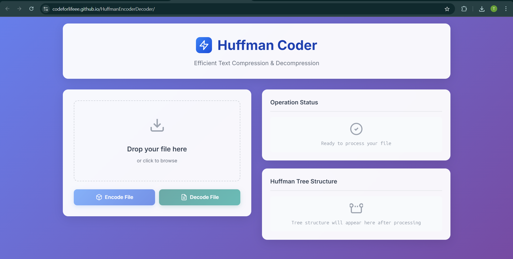

# 🗜️ Huffman Encoder/Decoder

A browser-based tool for **lossless text file compression and decompression** using the Huffman Coding algorithm. This project features a custom-built binary heap, visual representation of Huffman trees, and a modern responsive UI.

 <!-- Add a real screenshot named 'screenshot.png' in the repo -->

---

## 🚀 Features

- 📦 Compresses `.txt` files with up to **3×** size reduction.
- 🧠 Implements **Huffman coding** algorithm from scratch in JavaScript.
- 🧮 Custom **binary heap** for efficient tree construction.
- 📤 Drag-and-drop **file upload** with real-time tree visualization.
- 📊 Displays compression ratio and process logs.
- 🌐 **Responsive UI** with clean design and animation.

---

## 📂 Live Demo & Links

- 🔗 **Live Project:** [Huffman Coder Web App](https://codeforlifeee.github.io/HuffmanEncoderDecoder/)  
- 💻 **GitHub Repository:** [YourUsername/HuffmanCoder](https://github.com/codeforlifeee/HuffmanEncoderDecoder/)  
- 📄 **Sample Test File:** [`sample.txt`](./test/sample.txt)  
- 🎥 **Demo Video:** [YouTube Demo](https://www.youtube.com/watch?v=your-demo-link) *(optional)*  


---

## 🛠️ Technologies Used

- **JavaScript (ES6+)** – Core logic for Huffman coding and heap.
- **HTML5 + CSS3** – Structure and visual design.
- **Custom Max-Heap** – Used to manage character frequencies.

---

## 📁 Project Structure

```bash
├── index.html         # Main HTML file
├── style.css          # Styling with Glassmorphism & responsiveness
├── script.js          # UI handling, encode/decode triggers
├── heap.js            # Binary max-heap implementation
├── huffman.js         # HuffmanCoder class with encode/decode logic
└── README.md          # This file
